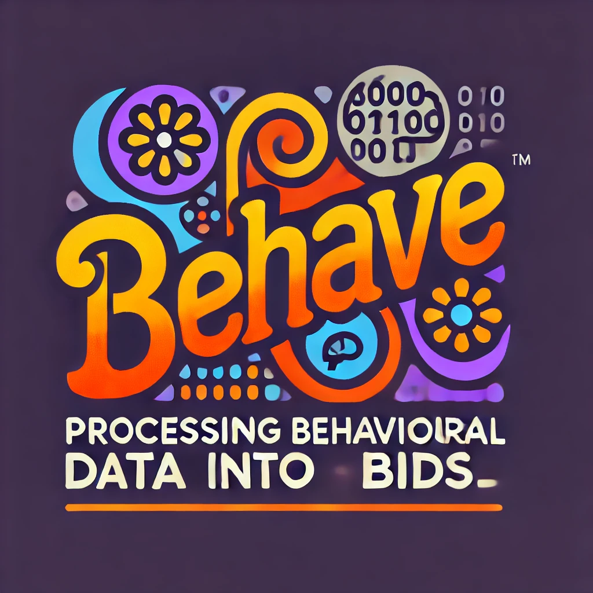

# BEHAVE - Behavioral Data to BIDS Converter

[](https://www.python.org/downloads/)
[](LICENSE)
[](https://bids.neuroimaging.io/)

A modular command-line tool that converts behavioral survey data from Excel files into BIDS-compliant JSON and TSV files for neuroimaging data repositories.



## 🎯 Features

- **📊 Excel to BIDS Conversion**: Automatically converts Excel survey data to BIDS format
- **🧩 Modular Architecture**: Clean separation of concerns across multiple modules
- **✅ Data Validation**: Comprehensive validation of input data and BIDS compliance
- **📝 Flexible Demographics**: Support for complex demographic data with custom data types
- **🏷️ Multiple Data Types**: Handles Likert scales, categorical data, and free-text responses
- **🔧 Robust Error Handling**: Detailed logging and error reporting
- **📦 Single-File Option**: Combined version for easy deployment
- **🚀 Fast Setup**: Quick installation with uv package manager

## 🎯 Super Easy Setup (For Students)

**Don't worry about virtual environments!** We've made it super simple:

### Option 1: Ultra-Easy Launcher (Recommended for Students)

Just download and run - everything is handled automatically:

```bash
# Linux/macOS
./behave_easy.sh -d data -r resources -o output -s YourStudy

# Windows
behave_easy.bat -d data -r resources -o output -s YourStudy
```

The easy launcher will:

- ✅ **Automatically detect** if you need a virtual environment
- ✅ **Automatically create** one if missing
- ✅ **Automatically install** all required packages
- ✅ **Automatically activate** the environment
- ✅ **Run the conversion** with your data

**No technical knowledge required!** 🎉

### Option 2: Smart Auto-Setup

The main script now detects and handles virtual environments automatically:

```bash
# Just run it - the script handles everything!
python behave.py -d data -r resources -o output -s YourStudy
```

If packages are missing, the script will ask: **"Would you like me to install the missing packages? (y/n)"**
Just type `y` and press Enter!

## 🚀 Traditional Installation (For Advanced Users)

### Option 1: Quick Setup with uv (Recommended)

The fastest way to get started is using our setup script with [uv](https://github.com/astral-sh/uv):

```bash
# Clone the repository
git clone https://github.com/MRI-Lab-Graz/behave.git
cd behave

# Run the setup script (creates virtual environment and installs dependencies)
chmod +x uv_setup.sh
./uv_setup.sh

# Activate the environment
source .behave/bin/activate  # On Linux/macOS
# or
.behave\Scripts\activate     # On Windows
```

### Option 2: Manual Installation with pip

```bash
# Clone the repository
git clone https://github.com/MRI-Lab-Graz/behave.git
cd behave

# Create virtual environment
python -m venv .behave
source .behave/bin/activate  # On Linux/macOS
# or
.behave\Scripts\activate     # On Windows

# Install dependencies
pip install -r requirements.txt
```

### Option 3: Single File Usage

For simple deployment, you can use the combined version without installation:

```bash
# Download just the combined file
wget https://raw.githubusercontent.com/MRI-Lab-Graz/behave/main/behave_combined.py

# Install dependencies
pip install pandas openpyxl

# Run directly
python behave_combined.py --help
```

## ⚡ Quick Start

```bash
# Convert behavioral data to BIDS format
python behave.py -d data -r resources -o output -s StudyName --debug

# Using the single-file version
python behave_combined.py StudyName /path/to/data /path/to/output --debug
```

## 📖 Usage

### Modular Version

```bash
python behave.py [OPTIONS]

Options:
  -d, --data PATH        Path to data folder containing session files
  -r, --resources PATH   Path to resources folder with questionnaire definitions
  -o, --output PATH      Path to output folder for BIDS data
  -s, --study TEXT       Study identifier (e.g., "StudyXYZ")
  --debug               Enable debug logging
  --anonymize           Anonymize question descriptions
  --skip-validation     Skip BIDS validation
  --log-file PATH       Log to file instead of console
  -h, --help            Show help message
```

### Single-File Version

```bash
python behave_combined.py STUDY_NAME DATA_PATH OUTPUT_PATH [OPTIONS]

Arguments:
  STUDY_NAME    Name of the study
  DATA_PATH     Path to data folder
  OUTPUT_PATH   Path to output folder

Options:
  --debug       Enable debug logging
  --anonymize   Anonymize question names
  -h, --help    Show help message
```

## 📁 File Structure

```text
your-project/
├── data/
│   └── StudyName/
│       ├── demographics.xlsx          # Participant demographics
│       ├── participants_dataset.xlsx  # Variable definitions
│       └── session1.xlsx              # Session data files
├── resources/
│   ├── questionnaire1.xlsx           # Task definitions
│   └── questionnaire2.xlsx
└── output/
    └── StudyName/
        └── rawdata/                   # BIDS output folder
            ├── participants.tsv
            ├── participants.json
            ├── dataset_description.json
            ├── task-questionnaire1_beh.json
            └── sub-001/
                └── ses-1/
                    └── beh/
                        └── sub-001_ses-1_task-questionnaire1_beh.tsv
```

## 📊 Excel File Format

### 1. Demographics File (`demographics.xlsx`)

Contains participant demographic information:

| id  | age | gender | education | ... |
|-----|-----|--------|-----------|-----|
| 001 | 25  | 1      | 3         | ... |
| 002 | 32  | 2      | 2         | ... |

### 2. Variables Definition File (`participants_dataset.xlsx`)

#### Sheet 1: Variable Definitions

| VariableName | DataType   | Description | Levels |
|-------------|------------|-------------|---------|
| age         | integer    | Age in years |        |
| gender      | cat_num    | Gender      | 1:Male; 2:Female; 3:Other |
| education   | cat_num    | Education level | 1:High School; 2:Bachelor; 3:Master |

#### Sheet 2: Dataset Description

| Key | Value |
|-----|-------|
| Name | My BIDS Dataset |
| BIDSVersion | 1.8.0 |
| DatasetType | raw |
| Authors | John Doe; Jane Smith |
| License | CC0 |

### 3. Session Files (`session1.xlsx`, etc.)

Contains responses for all participants:

| id  | ses | QUESTIONNAIRE1_item1 | QUESTIONNAIRE1_item2 | ... |
|-----|-----|---------------------|---------------------|-----|
| 001 | 1   | 3                   | 5                   | ... |
| 002 | 1   | 2                   | 4                   | ... |

### 4. Questionnaire Definition Files (`questionnaire1.xlsx`, etc.)

#### Sheet 1: Items

| itemname | itemdescription | likert_scale | levels | leveldescription | levels.1 | leveldescription.1 |
|----------|----------------|--------------|--------|------------------|----------|-------------------|
| item1    | How do you feel? | 5 | 1 | Very bad | 2 | Bad |
| item2    | Rate your mood  | 5 | 1 | Very low | 2 | Low |

#### Sheet 2: Task Description

| key name | description |
|----------|-------------|
| TaskName | Mood Assessment |
| Instructions | Please rate how you feel |

#### Sheet 3: Non-Likert Items

| key name | description |
|----------|-------------|
| ResponseTime | Response time in milliseconds |
| Notes | Additional notes |

## 📋 BIDS Output

The tool generates a complete BIDS-compliant dataset:

### `participants.tsv`

```text
participant_id	age	gender	education
sub-001	25	1	3
sub-002	32	2	2
```

### `participants.json`

```json
{
    "participant_id": {
        "Description": "Unique participant identifier"
    },
    "age": {
        "Description": "Age in years"
    },
    "gender": {
        "Description": "Gender",
        "Levels": {
            "1": "Male",
            "2": "Female", 
            "3": "Other"
        }
    }
}
```

### `task-questionnaire1_beh.json`

```json
{
    "item1": {
        "Description": "How do you feel?",
        "Levels": {
            "1": "Very bad",
            "2": "Bad",
            "3": "Neutral",
            "4": "Good", 
            "5": "Very good"
        }
    }
}
```

### `sub-001_ses-1_task-questionnaire1_beh.tsv`

```text
item1	item2	item3
3	5	2
```

## ⚙️ Configuration

The tool can be configured through the `config.py` module:

```python
@dataclass
class BehaveConfig:
    # File requirements
    min_required_sheets: int = 3
    
    # Data processing
    anonymize_questions: bool = False
    missing_value_replacement: str = 'n/a'
    missing_value_code: int = -999
    
    # BIDS settings
    bids_version: str = "1.8.0"
```

## 💡 Examples

### Example 1: Basic Conversion

```bash
# Convert a simple study
python behave.py \
    --data ./data \
    --resources ./resources \
    --output ./bids_output \
    --study "PilotStudy" \
    --debug
```

### Example 2: With Anonymization

```bash
# Anonymize question descriptions
python behave.py \
    -d ./data \
    -r ./resources \
    -o ./output \
    -s "Study001" \
    --anonymize \
    --log-file conversion.log
```

### Example 3: Single File Version

```bash
# Using the combined version
python behave_combined.py "MyStudy" ./data ./output --debug
```

## 🔧 Troubleshooting

### Common Issues

**Issue**: `"delimiter" must be a 1-character string`
**Solution**: This was a bug in earlier versions. Update to the latest version.

**Issue**: Missing required Excel sheets
**Solution**: Ensure your questionnaire files have at least 3 sheets (items, task description, non-likert).

**Issue**: BIDS validation errors
**Solution**: Check that all required fields are present in your dataset description.

### Debug Mode

Always use `--debug` flag for detailed logging:

```bash
python behave.py --debug [other options]
```

### Log Files

Save logs to file for later analysis:

```bash
python behave.py --log-file conversion.log [other options]
```

## 📋 Requirements

- Python 3.8+
- pandas >= 1.3.0
- openpyxl >= 3.0.0
- colorama (for colored terminal output)

## 🏗️ Architecture

The tool is built with a modular architecture:

- **`config.py`**: Configuration and constants
- **`excel_handler.py`**: Excel file loading and processing
- **`validators.py`**: Data validation and BIDS compliance
- **`bids_converter.py`**: Main conversion logic
- **`behave.py`**: Main orchestrator script
- **`behave_combined.py`**: Single-file version

## 🧪 Testing

```bash
# Run with test data
python behave.py \
    --data ./data/template \
    --resources ./resources \
    --output ./test_output \
    --study "TestStudy" \
    --debug
```

## 🤝 Contributing

1. Fork the repository
2. Create a feature branch (`git checkout -b feature/amazing-feature`)
3. Commit your changes (`git commit -m 'Add amazing feature'`)
4. Push to the branch (`git push origin feature/amazing-feature`)
5. Open a Pull Request

### Development Setup

```bash
git clone https://github.com/your-username/behave.git
cd behave
./uv_setup.sh
source .behave/bin/activate
```

## 📄 License

This project is licensed under the MIT License - see the [LICENSE](LICENSE) file for details.

## 🙏 Acknowledgments

- **MRI-Lab Graz** - Original development
- **BIDS Community** - For the BIDS specification
- **Contributors** - For improvements and bug fixes

## 📞 Support

- 🐛 **Bug Reports**: [GitHub Issues](https://github.com/your-username/behave/issues)
- 💡 **Feature Requests**: [GitHub Discussions](https://github.com/your-username/behave/discussions)
- 📧 **Email**: your-email@example.com

## 🔗 Related Projects

- [BIDS Specification](https://bids.neuroimaging.io/)
- [BIDS Validator](https://github.com/bids-standard/bids-validator)
- [pybids](https://github.com/bids-standard/pybids)

---

Made with ❤️ by the MRI-Lab Graz team

Convert behavioral Excel files into BIDS-compatible `JSON` and `TSV` files.

**Arguments:**

- `-d`, `--data`: Path to the folder containing raw behavioral data.
- `-r`, `--resources`: Path to the resources folder (must contain Excel files like `demographics.xlsx` and `participants_variables.xlsx`).
- `-o`, `--output`: Output folder where BIDS files will be saved.
- `-s`, `--study`: Study name (e.g., `template`).
- `--debug`: Optional. Enables detailed debug logging.
- `-h`, `--help`: Show help message and exit.

------

## 📁 File Format Details (Reference to files on this github repo)

### 🗂 Folder Structure

Ensure your data is organized using the following structure (a sample is included in the repository).

The example folder is named `/data/template`, but you should rename this folder to match your own study ID — for example, `/data/best_study_ever`.

Each session should have its own `sessionX.xlsx` file (`session1.xlsx`, `session2.xlsx`, etc.).
Even for cross-sectional studies with only one session, a `session1.xlsx` file is still required.

> 🔒 **Important:**
> Do **not** rename the following core files — they must always be named exactly as shown:
>
> - `demographics.xlsx`
> - `participants_dataset.xlsx`

These filenames are required by the BEHAVE script to function correctly.

```
behave/
├── data/
│   └── template/
│       ├── session1.xlsx (1 sheets)
│       ├── demographics.xlsx (1 sheets)
│       └── participants_dataset.xlsx (1 sheets)
├── resources/
│   └── testquest.xlsx   ← (task definition with 3 sheets)
```

To successfully run `BEHAVE`, you need the following Excel files organized with specific column structures. Here's what they should look like:

------

### 

The `demographics.xlsx` and `participants_dataset.xlsx` files work together to define participant-level information:

- **`demographics.xlsx`** contains the raw participant data — similar to the `participants.tsv` file in BIDS.

- **`participants_dataset.xlsx`** provides the metadata for each column in `demographics.xlsx`, including variable names, descriptions, and data type (similar to the participants.json)

In short, `demographics.xlsx` holds the data, while `participants_dataset.xlsx` describes and defines it.
### 🧍‍♂️ `demographics.xlsx`

**Location:** `data/STUDY_NAME/demographics.xlsx`

**Purpose:** Provides subject-level information such as age, sex, and group.

**Example Columns:**
First column is required, rest is up to you!

| Column   | Description                        |
| -------- | ---------------------------------- |
| `id`     | Subject ID (e.g., `sub-001`)       |
| `ses`    | Session number (e.g., `1`)         |
| `age`    | Age in years                       |
| `sex`    | Biological sex (coded numerically) |
| `size`   | Height or body size                |
| `weight` | Weight in kilograms                |
| `group`  | Experimental group assignment      |

**Example:**

```
id       ses   age   sex   size   weight   group
sub-001   1     34     2    190     100       2
sub-002   1     20     2    184      80       3
```
------

### 🧾 `participants_dataset.xlsx`

**Location:** `data/STUDY_NAME/participants_dataset.xlsx`

**Purpose:** Defines and describes each participant-level variable. Has two sheets:

#### 📄 Sheet 1 — Variable Definitions

| Column         | Description                                       |
| -------------- | ------------------------------------------------- |
| `VariableName` | Name of the variable (e.g., `age`, `sex`)         |
| `Description`  | Human-readable description of the variable        |
| `DataType`     | Data type (`string`, `integer`, `cat_num`)        |
| `Levels`       | Value mappings for categorical variables (if any) |

**Example:**
```
VariableName   Description           DataType   Levels
id             Participant ID        string
age            Age in years          integer
sex            Biological sex        cat_num    1: Male; 2: Female
```
Note: "cat_num" expects to specify Levels as key:value.

#### 📄 Sheet 2 — Dataset Metadata

| Column            | Example Value |
| ----------------- | ------------- |
| `Name`            | `BIDSVersion` |
| `My Bids dataset` | `1.7.0`       |

Used to auto-generate `dataset_description.json`.

------

### 🧪 `sessionX.xlsx`

**Location:** `data/STUDY_NAME/session1.xlsx`

**Purpose:** Contains item-level responses from a behavioral task.

**Required Columns:**

| Column           | Description                                      |
| ---------------- | ------------------------------------------------ |
| `id`             | Subject ID (`sub-001`, etc.)                     |
| `ses`            | Session number                                   |
| `testquest01...` | One column per task item (e.g., Likert response) |


**Example:**

```
id       ses   testquest01  testquest02  testquest03  ...
sub-001   1           0            1           3
sub-002   1           2            1           2
```

Each item must match a variable defined in the corresponding task file in the `/resources/` folder.

------

## 🧾 Task File Format (`resources/[task].xlsx`)

Each behavioral task should be described using an Excel file inside the `resources/` folder. This file guides how the item-level responses in `sessionX.xlsx` are interpreted.

**Sheet 1** should include the following structure:

| Column Name        | Description                                                  |
| ------------------ | ------------------------------------------------------------ |
| `itemname`         | Unique column name matching those in `sessionX.xlsx` (e.g., `testquest01`) |
| `itemdescription`  | Full question or prompt presented to participants            |
| `likert_scale`     | Number of scale levels (0 if non-likert)                     |
| `levels`           | Response code (e.g., `0`, `1`, `2`, ...)                     |
| `leveldescription` | Text description for each level (must pair with a `levels` value) |

Additional pairs of `levels` and `leveldescription` can be added for multi-scale items.

------

### ✅ Example

**File:** `resources/example_task.xlsx`
**Sheet 1:** (Item Metadata)

| itemname    | itemdescription                                              | likert_scale | levels | leveldescription                          | ...  |
| ----------- | ------------------------------------------------------------ | ------------ | ------ | ----------------------------------------- | ---- |
| testquest01 | I feel confident in my ability to complete tasks at work.    | 4            | 0      | Rarely or none of the time                | ...  |
| testquest02 | I enjoy participating in group discussions and activities.   | 4            | 1      | Some or a little of the time              | ...  |
| testquest03 | I often feel stressed when managing multiple responsibilities. | 4            | 2      | Occasionally or a moderate amount of time | ...  |


ℹ️ You may include additional `levels`/`leveldescription` columns if needed (e.g., for 5-point or alternative scales).

------

### 🔐 Key Rules

- Every `itemname` **must match** a column in `sessionX.xlsx`.
- `likert_scale` defines how many levels exist (e.g., 4 for a 0–3 scale).
- You **must provide matching `levels` and `leveldescription` pairs**.
- If your item is not a Likert scale, set `likert_scale` to `0`.

## 📋 Task Metadata — Sheet 2 (`resources/[task].xlsx`)

**Purpose:** Describes the behavioral task for the BIDS sidecar JSON file (`task-[name]_beh.json`).

This sheet should contain **key-value pairs** that correspond to standard BIDS fields describing behavioral tasks.

| Column Name   | Description                                                  |
| ------------- | ------------------------------------------------------------ |
| `Key name`    | The BIDS-compliant JSON field name (e.g., `TaskName`, `Instructions`) |
| `Description` | Human-readable explanation of the field                      |
| `Data type`   | Expected data type: `string`, `number`, `URI`, etc.          |
| `Info`        | The value to include in the JSON (this is what BEHAVE will extract and write into the `.json` file) |


------

### ✅ Example

| Key name                      | Description                                     | Data type | Info                       |
| ----------------------------- | ----------------------------------------------- | --------- | -------------------------- |
| `TaskName`                    | Name of the task. Becomes part of the filename. | string    | `testquest`                |
| `Instructions`                | Text shown to participants before the task      | string    | `You should be honest...`  |
| `TaskDescription`             | Longer description of the task                  | string    | `Some info about the test` |
| `CogAtlasID`                  | URI for Cognitive Atlas task term               | string    | `Not categorised`          |
| `CogPOID`                     | URI for CogPO term                              | string    | `Not categorised`          |
| `InstitutionName`             | Institution responsible for the task            | string    | `University of Graz`       |
| `InstitutionAddress`          | Address of the institution                      | string    | `Kopernikusgasse`          |
| `InstitutionalDepartmentName` | Department name at the institution              | string    | `MRI Lab Graz`             |

------
### 📌 Tips

- Only **one row per key** is required.
- This information is used to automatically generate the `task-[taskname]_beh.json` file in your BIDS output.
- Task names are sanitized automatically (e.g., `test quest` → `testquest`).
______

### ➤ Additional Tool: `behave_together`

```
python behave_together.py [-h] -b BIDS_DIR -t TASKS [TASKS ...] [--all]
```

Gather behavioral BIDS data across multiple tasks into a single wide CSV.

**Arguments:**

- `-b`, `--bids_dir`: Top-level BIDS directory.
- `-t`, `--tasks`: List of task names to include (e.g., `-t ADS GNG`).
- `--all`: Optional. Automatically gather all tasks found via `task-*_beh.json`.
- `-h`, `--help`: Show help message and exit.

------

# 📦 Installation

## Step 1: Clone the Repository

```
git clone https://github.com/your-username/behave.git
cd behave
```

## Step 2: Set Up the Environment

Run the setup script to create a virtual environment and install required packages:

- **Windows:**

  ```
  uv_setup.bat
  ```

- **macOS/Linux:**

  ```
  ./uv_setup.sh
  ```

## Step 3: Activate the Environment

```
source .behave/bin/activate
```

To deactivate later:

```
deactivate
```

------

## 🧰 Requirements

Ensure Python 3.8+ is installed.

The following Python packages will be installed automatically via the setup script:

- `pandas` – Data manipulation
- `openpyxl` – Excel reading
- `numpy` – Numerical operations
- `colorama` *(optional)* – Colored terminal output

**Standard libraries used** (no installation needed):

- `os`, `json`, `logging`, `re`

------

## ✅ Manual `uv` Installation (Windows Only)

If `uv` is not yet installed, follow these steps:

### 1. Download `uv`

Go to the [uv releases page](https://github.com/astral-sh/uv/releases) and download:

```
uv-x86_64-pc-windows-msvc.zip
```

### 2. Extract the ZIP

Extract it to:

```
C:\Users\YourUsername\Programs\uv\
```

You should now have `uv.exe` in that folder.

### 3. Add to PATH

- Open **Environment Variables** via system settings.

- Edit your `Path` under **User variables**.

- Add:

  ```
  C:\Users\YourUsername\Programs\uv\
  ```

### 4. Verify Installation

Open a new terminal and run:

```
uv --version
```

You should see the version number printed.
